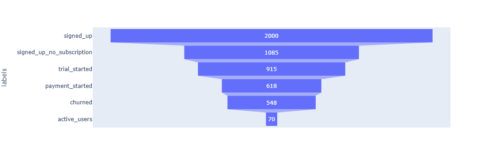
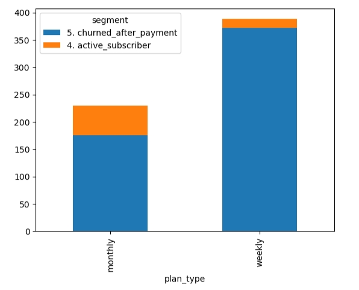

# 🚀 Аналитика воронки и сегментации в подписочном SaaS

Проект демонстрирует навыки продакт-аналитика: от генерации данных до формулировки продуктовых гипотез на основе поведения пользователей.

---

## 📊 Ключевые инсайты

### 1. Воронка конверсии


- **Установили приложение**: 2000
- **Зарегистрировались**: 1085 (54%)
- **Начали триал**: 915 (46%)
- **Оплатили**: 618 (31%)
- **Ушли после оплаты**: 548 (27%)
- **Активны сейчас**: 70 (3.5%)

👉 **Главная утечка — на этапе регистрации → триал (54% теряются)**

---

### 2. Распределение по планам среди платящих


- **Weekly**: 388 пользователей (66%)
- **Monthly**: 230 пользователей (34%)

✅ **Weekly-планы популярнее, но активных пользователей больше в Monthly? Нужно проверить retention.**

---

## 💡 Продуктовые гипотезы

### Гипотеза 1: Улучшить онбординг для повышения конверсии в триал
> *Если добавить прогресс-бар и персонализированный выбор блюда в онбординге, конверсия `signup → trial_started` вырастет с 46% до 60%.*

**Метрики**:  
- Primary: % пользователей, начавших триал  
- Guardrail: время прохождения онбординга

---

### Гипотеза 2: Реактивация ушедших через email + скидку
> *Если отправлять email с "ваше любимое блюдо снова в меню" за 3 дня до окончания подписки, retention Day 60 вырастет на 20%.*

**Метрики**:  
- Primary: % повторной оплаты  
- Secondary: CTR на email

---

### Гипотеза 3: Повысить LTV через реферальную программу
> *Если внедрить "пригласи друга — получи неделю бесплатно", viral coefficient вырастет до 0.3, а LTV — на 15%.*

---

## 🛠️ Технические детали

- Язык: Python
- Библиотеки: pandas, plotly, matplotlib
- Данные: синтетически сгенерированы (код в `notebooks/`)
- Визуализации: сохранены в `dashboards/`

---

## 🔗 Как запустить

1. Клонируйте репозиторий:
   ```bash
   git clone https://github.com/holengen/product-analytics-funnel-segmentation.git
